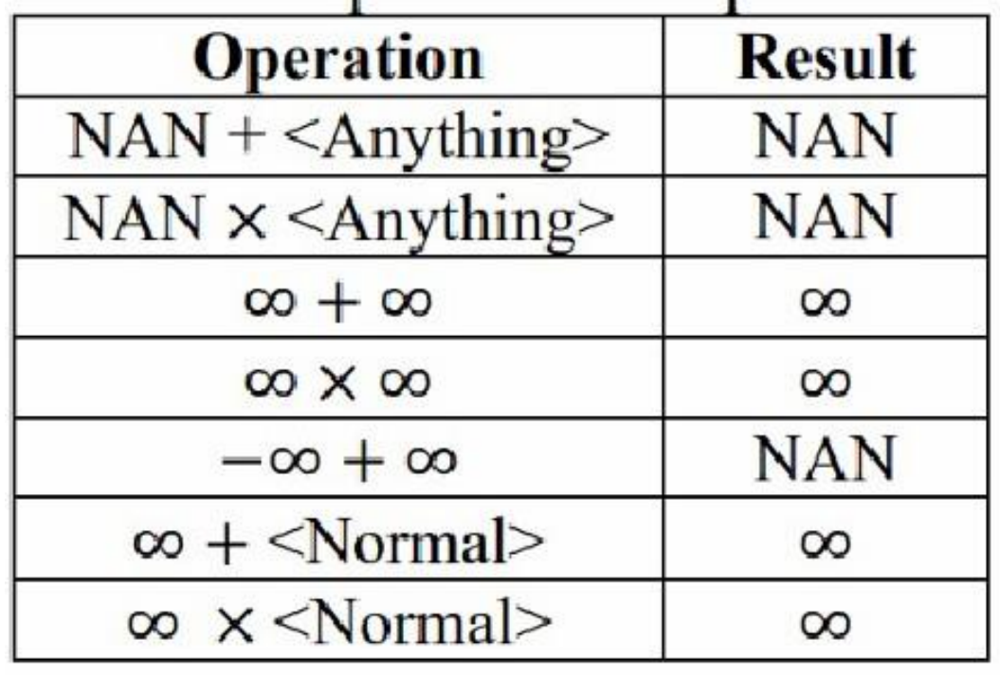
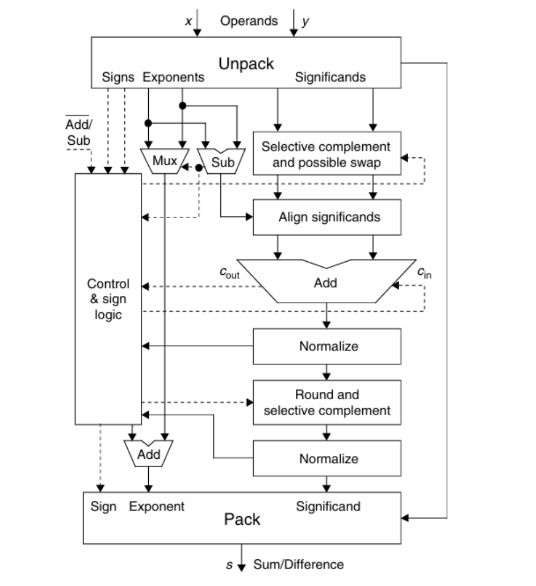
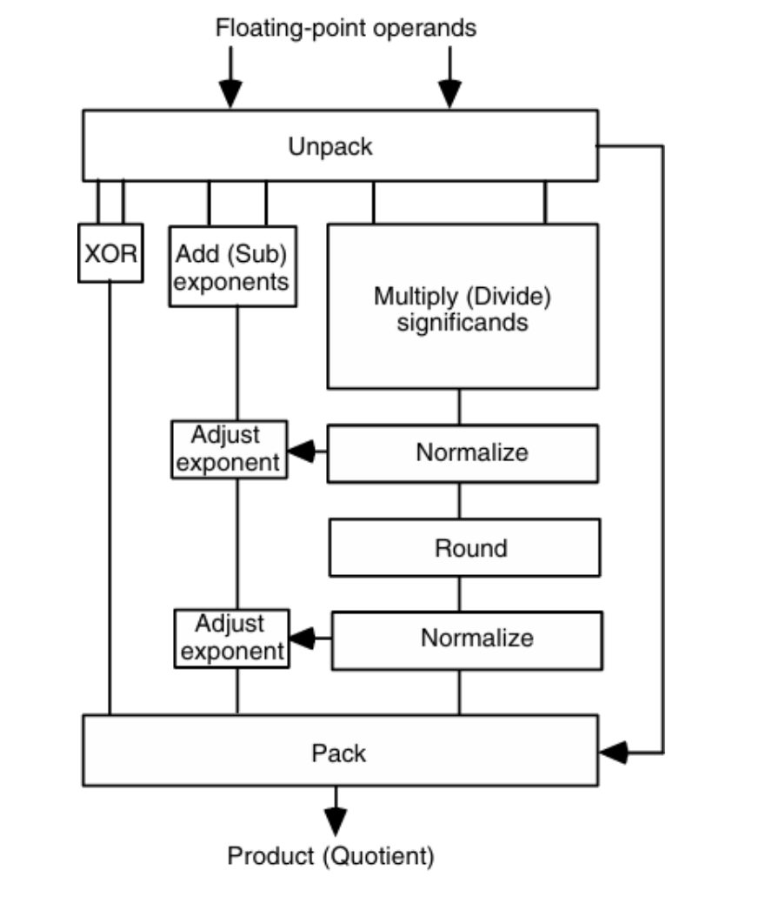
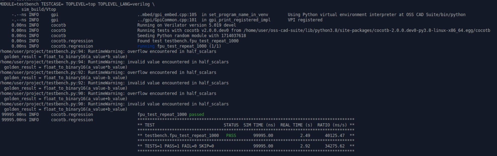

# 16-bit FPU

Zhehua Xiang

18-224 Spring 2024 Final Tapeout Project

## Overview

This project is an IEEE-754 16-bit floating-point unit. It takes in 2 floating-point numbers and 1 operation and computes the answer.
It is capable of 3 operations: addition, subtraction, and multiplication.

## How it Works

This section focuses on the internal calculation. Instructions on how to send inputs / receive outputs are listed in the next section.
Once 2 input numbers are ready, the combinational calculation starts based on the operation.

### Special Cases

A few special cases (such as NaN, 0, inf) will quickly lead to an answer. A table for these cases is shown below.

#### Addition/Subtraction

There are 5 major steps for addition/subtraction:
1. Reconstruct inputs to match exponents.
2. Add/subtract significants to get a temp result.
3. Do normalization and adjust exponents if necessary.
4. Check if the exponent is valid, then do rounding.
5. After rounding, check for normalization and valid exponent again.

A datapath for addition/subtraction is shown below.

### multiplication

There are 5 major steps for multiplication:
1. Get real exponents by getting rid of bias.
2. Add real exponents and multiply significants to get a temp result.
3. Do normalization and adjust exponents if necessary.
4. Check if the exponent is valid, then do rounding.
5. After rounding, check for normalization and valid exponent again, then add the bias back.

A datapath for multiplication is shown below.

## Inputs/Outputs

10 of the IO ports are used for both input and output.

Input ports:
* First 8 bits: input number or operation.
* Last 2 bits: what is currently being sent (00 means nothing, 01 means number 1, 10 means number 2, 11 means operation).
* We start the task by sending number 1, the first 10 bits that go into the input ports should consist of the first 8 bits being [7:0] of number 1 and the last 2 bits being 01. Then, at the next clock cycle, the first 8 bits should change to [15:8] of number 1, while the last 2 bits remain at 01 (since we're still sending number 1). Thus, data transfer for number 1 should take 2 consecutive cycles.
* Once the data transfer for number 1 has finished, the lowest 2 bits should no lnger be 01, otherwise initial data 1 would be overwritten.
* Same thing for number 2.
* Sending operation should only take 1 cycle. 0001 means addition, 0010 means subtraction, and 0100 means multiplication.
* Once the FPU receives the operation input, it will do the computation, and the output will be ready in the same clock cycle.

Output ports:
* First 8 bits: output number.
* Last 2 bits: 00 means no output available, 11 means sending outputs.
* 11 will stay for 2 cycles, and the final output should be the the first 8 bits of the 2 cycles combined together.

## Hardware Peripherals

FPGA will be used for testing after tape-out.

## Design Testing / Bringup

### verification

* For this 16-bit FPU design, a CoCoTB testbench was implemented. It is named "testbench.py" under this repo, along with a Makefile.

* In this testbench, random inputs and operations are generated. Data is then loaded into the FPU in several cycles. 

* The output is the read-out for checking.

* Special assertions were implemented for special cases (such as NaN, 0, denormal, overflow...)

* A golden model written in Python is used to compare results under normal cases.

* This random test is repeated 1000 times to ensure functionality.

### Testing after tape-out

* The current plan for testing is to connect the chip with an FPGA.

* The FPGA will provide a clock, feeding in inputs and reading out outputs.

* The output bits will be printed into text and parsed for correctness checking.

## Media

Below is the result for CoCoTB verification.

## Reference

Behrooz, Parhami. "Computer arithmetic: Algorithms and hardware designs. 2nd edition"

